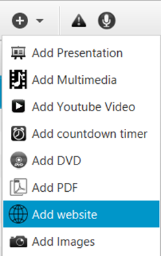
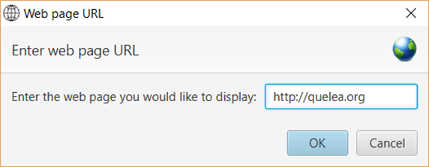
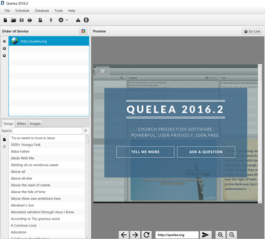
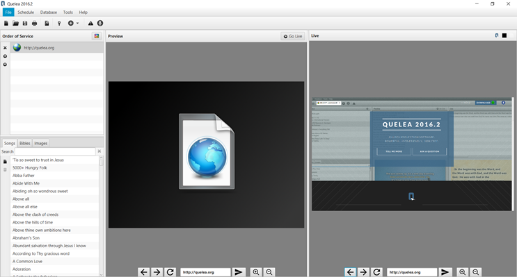

# Usage

Another feature that makes Quelea rather unique is the ability to
project a website. Just select “Add website” in either the add menu
(plus sign) or in the Schedule menu.

Then you need to add the URL to the website you want to display.

When you click OK, the website will be added to your schedule and start
loading in the background. If you preview the item, you should see the
web page loaded along with a few extra buttons.

You could then navigate to any subpage you might want to show or enter a
new URL in the text box. When you are ready to show it live, click “Go
live”.

Click directly on the preview image to pass a click onto the website and
use the buttons to go back/forward, refresh, go to a new URL or zoom
in/out.

# Limitations

This section is further information about the feature, explaining why it
might not always work the way you expect it to.

* You might notice is that the preview image does not look the same
way as it did before. Basically this is due to limitations in Java
where you only can have one instance of the website, meaning that
the website is moved from inside of the Quelea main window to the
projection area. As long as it is not live (in preview or hidden
with either of the buttons), the website is in the Quelea main
window and as long as you show it live, it is actually only in the
projection (and what you see in the main window is a screenshot of
it). Given that your projection area probably is larger than the
small area it has in the main window, it might affect the layout of
the website when it is moved.
* You might also notice that the preview image might not be updated
smoothly in Quelea and that is intentionally set to a slower refresh
rate to not overload slower computers. Note that the potential lag
you might experience is only visible for you, not the people
watching the projection.
* Note, if you use
\[<https://www.tenforums.com/tutorials/5990-dpi-scaling-level-displays-change-windows-10-a.html>|
scaling\] in Windows the mouse clicks on the preview image will not
be accurate.
* Lastly, we must mention that the web browser that exists in Java
(which this is built on) is relatively old, which means that some
websites will not be possible to display. For instance, you cannot
show anything built with Flash, e.g. like older YouTube videos use.
This is not something we can do anything about, other than hope that
a future Java update will contain an updated browser.

-----

[← Displaying a PDF](Displaying_a_PDF.md "Displaying a PDF")
&nbsp;&nbsp;&nbsp;&nbsp;&nbsp;&nbsp;&nbsp;&nbsp;&nbsp;&nbsp;&nbsp;&nbsp;&nbsp;&nbsp;&nbsp;&nbsp;&nbsp;&nbsp;&nbsp;&nbsp;&nbsp;&nbsp;&nbsp;&nbsp; [Displaying an image group
→](Displaying_an_image_group.md "Displaying an image group")

---
